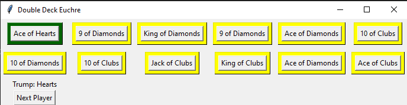

# Double Deck/Bid Euchre
Python CLI and GUI implementation of double deck/bid euchre using only the Python Standard Library

## Screenshots

*Ugly text buttons to be replaced with picture representations of the cards*

## Links
* [Game rules](https://gradeless.com/la/in_bid_euchre.pdf)